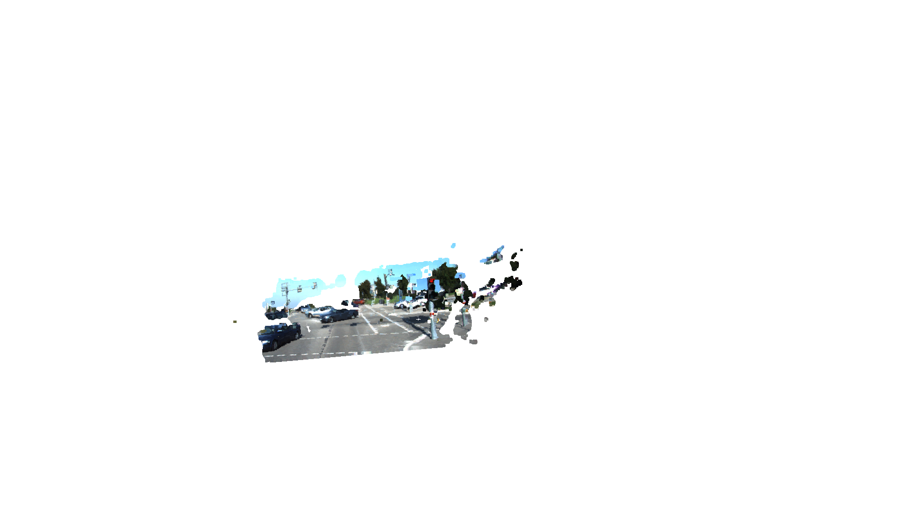
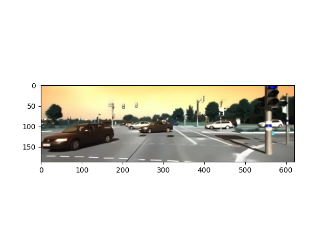
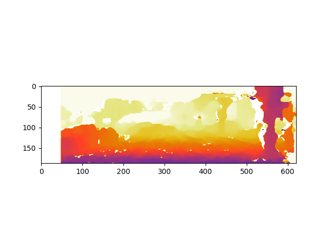
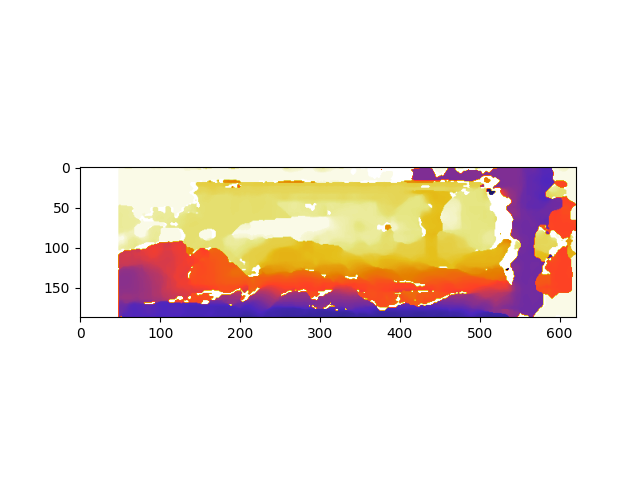
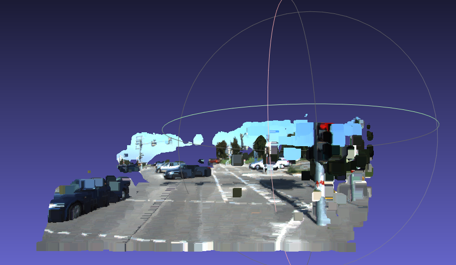
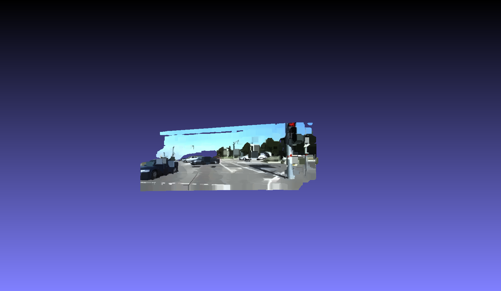

# 3D Scene Reconstruction from Stereo Images


Turns a pair of stereo images of a street scene into a coloured 3D point cloud.
The pipeline denoises both images, computes a disparity map with semi-global block
matching, and reprojects every pixel into 3D space using the camera calibration.
This is the reconstruction stage of a larger scene segmentation and detection
project, which targets scenes with large planar areas (roads) and large objects
on them (cars).



## How it works

1. **Load and downscale** the left and right images (`imageL.png`, `imageR.png`)
   with an image pyramid, for faster processing.
2. **Denoise** each image with non-local means
   (`cv2.fastNlMeansDenoisingColored`), then convert to greyscale and blur
   lightly before matching.
3. **Compute disparity** with `cv2.StereoSGBM_create` (semi-global block
   matching, block size 11, 48 disparity levels, with smoothness penalties
   P1 and P2).
4. **Build the reprojection matrix Q** with `cv2.stereoRectify`, using the
   camera intrinsics and the 0.54 m stereo baseline from `calibration.txt`.
5. **Reproject to 3D** with `cv2.reprojectImageTo3D`, colour each point from
   the left image, and filter out invalid disparities and far-off points.
6. **Export** the result as an ASCII `.ply` point cloud (`cloud.ply`) and view
   it in 3D with Open3D.

## Results

| Denoised input | Disparity before tuning | Disparity after tuning |
|---|---|---|
|  |  |  |

| Point cloud before | Point cloud after |
|---|---|
|  |  |

Denoising the inputs and tuning the matcher parameters gives a noticeably
smoother disparity map and a cleaner point cloud with fewer stray points.

## Running it

```bash
pip install opencv-python numpy matplotlib open3d

python main.py      # shows the images and disparity map, writes cloud.ply
python display.py   # opens cloud.ply in an interactive 3D viewer
```

## Project structure

```
main.py           # full pipeline: denoising → disparity → 3D points → cloud.ply
display.py        # interactive point-cloud viewer (Open3D)
calibration.txt   # camera projection matrices for the stereo pair
imageL.png        # left stereo image
imageR.png        # right stereo image
cloud.ply         # generated point cloud
results/          # screenshots of each stage
```

## Skills demonstrated

Stereo vision, disparity estimation (SGBM), camera calibration and the
reprojection matrix, image denoising, 3D point-cloud generation and
visualisation, OpenCV, NumPy, Open3D.
